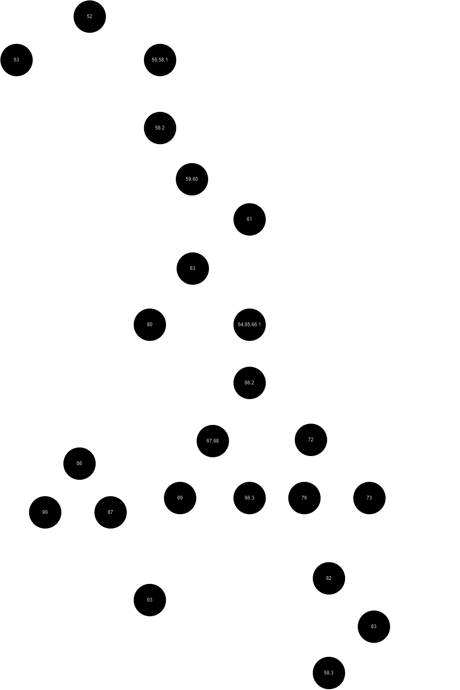

## Адриан Михајловски 226015

### Control Flow Draw

### Цикломатска комплексност

Според формулата P + 1, каде P претствавува бројот на предикатни јазли и во нашиот случај е 9, имаме цикломатска 
комплексност од 10. Истото можеме да го видиме и со броење на регионите во CFG-от.